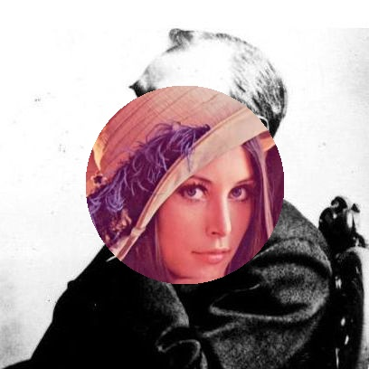

## 第一题
### 算法描述

目标是实现两张图的场景切换，类似虹膜切换的效果。因此思考首先生成多个帧，最后合并成 GIF, 每帧的圆形从小到大变化。首先确定图片 1 的中心点，然后通过判断圆心距的方式来进行圆形选区。对图片 1 的像素进行遍历，判断该点是否在圆形选区内，如果在，则将该点的 RGB 值替换成图片 2 的 RGB。通过这样，生成多张帧，最后合并成
GIF 就可以实现题目要求。

大致思路：
```
Center = （图片 1 的宽度/2，图片 1 的高度/2）
FOR R IN 半径
FOR point IN 图片 1
IF point 在 以 center 为圆心，R 为半径的圆中
图片 1.point.RGB = 图片 2.point.RGB
保存当前半径生成的图片
```
### 程序实现

实现部分使用 `python` 语言，主要用到的库有
`opencv、numpy、imageio`。读取图片，图片相当于一个矩阵，遍历像素就是遍历矩阵，而修改 `RGB` 的值就是修改矩阵对应的值

合成 `GIF` 时使用了 `imageio` 这个库

源代码
```python
from numpy import 
import cv2
import imageio
# 导入图片
lena= cv2.imread('./multimedia/lena.jpg')
nobel = cv2.imread('./multimedia/nobel.jpg')
nobel1 = cv2.imread('./multimedia/nobel.jpg')
# 生成不同半径，范围是 0-300，每次差距 10
radius = range(0,300,10)
# 生成不同的帧
for i in radius:
for x in range(0,407):
for y in range(0,407):
if(((x-204)(x-204)+(y-204)(y-204))<ii):
nobel1[x,y,0]=lena[x,y,0]
nobel1[x,y,1]=lena[x,y,1]
nobel1[x,y,2]=lena[x,y,2]
cv2.imwrite("./res"+str(i)+".jpg",nobel1)
#将帧整合成 GIF
frames=[]
for i in radius:
frames.append(imageio.imread("./res"+str(i)+".jpg"))
imageio.mimsave("change.gif",frames,"GIF",duration=0.1)
```
### 效果部分

生成的每一帧的图片，保存在 task1/frames 文件夹下，最后效果为 change.gif

  
  
  
     
  

通过图片看到，我们成功生成了半径不同大小的圆，实现了图片在指定区域的覆盖，并且最终整合成
GIF。

##
### 算法描述

首先我们要建立颜色查找表，有 256 行，每行代表一个 25 位颜色。相当于我们把 24 位色彩空间切割成 256 个小块，每个小块有一个代表颜色。对于任意一张图片，我们用块号转化成 8 位的块号值。我们采用中值区分算法生成 256 个区域：

1.  将图片内的所有像素加到一个区域
2.  分别计算该区域 R,G,B 的极差
3.  选区相差颜色最大的颜色
4.  根据选中的颜色排序当前区域的像素
5.  根据排序的中值，切割区域，生成新的两个区域
6.  重复 2-5 直到我们有 256 个区域，每次选择切分的区域是具有最大极差的区域，或者说是边最长的。
7.  计算每个区域的代表色，即计算每个区域 R,G,B 的平均值
8.  根据每个像素的 RGB 值与区域的中心值的欧式距离，给每个像素分配一个代表颜色。在指向代表颜色的查找表中，用编号代替像素。

### 程序实现

使用 python 语言，主要用到的库有 `statistics，PIL`。

程序实现主要包含两部分：

1.  使用中值切分算法生成 256 个色彩区域。

首先定义结构体 ColorCube, 代表一个颜色块：

包含以下重要属性和方法
```
1. Colors: 该颜色块所包含的所有颜色，也就是所有的 RGB 取值
2.  red,green,blue: 三个通道的所有取值
3.  max_range: 记录 R,G,B 中三个通道中极差最大的值
4.  max_channel: 记录 max_range 出现的通道
5.  average 方法：根据该颜色块的 R,G,B 的平均值，得到代表色
6.  split 方法：将颜色块根据 max_channel 的中值进行分割
7.  __lt__: 重载小于号，用来对区域进行排序
```

结构体代码
```python
class ColorCube(object):
def __init__(self, colors):
self.colors = colors or []
self.red = [r[0] for r in colors]
self.green = [g[1] for g in colors]
self.blue = [b[2] for b in colors]
self.max_range = max(self.size)
self.size = (max(self.red) - min(self.red),
max(self.green) - min(self.green),
max(self.blue) - min(self.blue))
self.max_channel = self.size.index(self.max_range) #mark which
channel has max_range
def split(self): # split a cube into two cubes by the color with
max_range 
middle = len(self.colors) // 2
colors = sorted(self.colors, key=lambda c: c[self.max_channel])
return ColorCube(colors[:middle]), ColorCube(colors[middle:])
def average(self): # calculate the representative color
logging.info('Averaging cube with {} colors'.format(len(self.colors)))
r = int(mean(self.red))
g = int(mean(self.green))
b = int(mean(self.blue))
return r, g, b

def __lt__(self, other): # use for sort
return self.max_range < other.max_range
```
接下来实现 `median-cut` 算法，根据算法描述实现即可：
```python
def median_cut(img):
colors = []
logging.info('Creating list of colors')
for color_count, color in img.getcolors(img.width 
img.height):
colors += [color]  color_count
cubes = [ColorCube(colors)]
while len(cubes) < 256:
cubes.sort()
cubes += cubes.pop().split()
return [c.average() for c in cubes]
```

显示颜色查找表中的颜色，通过 `median_cut` 方法我们可以获得一张图片的 `256` 个代表色，创建画布将颜色输出出来：
```python
def show_lut(colors)
color_width = img.width / len(colors
color_height = int(max(100, color_width)
color_size = (int(color_width), color_height
color_x = 
palette = Image.new('RGB', (img.width, color_height)
for color in colors
color = Image.new('RGB', color_size, color
palette.paste(color, (int(color_x),0)
color_x += color_widt
palette.show(
return palett
img = Image.open('./multimedia/redapple.jpg')
colors = median_cut(img)
palette = show_lut(colors)
```

最后我们获取一张图片的所有颜色，然后根据欧式距离，给每个像素分配一个代表颜色，这个步骤会很慢很慢，因为所提供的苹果图片的颜色 9 万种，对于每个颜色我们都要循环 `256` 次计算距离。最后用代表颜色替代原来的像素，生成新的图片：
```python
#get colors of the picture

rgb=(img.getdata())
rgb=list(rgb)
print(len(set(rgb)))
rgb=np.array(rgb)
rgbRepresent=[]
#get represent color for every color in origin picture
for i in rgb:
print i
dist=[]
for j in colors:
dist.append(np.sqrt(sum((i-j)2))) #calculate distance 
dist=np.array(dist)
rgbRepresent.append([colors[dist.argsort()[0]]]) # choose the
nearest cube
# create new images with replace color
rgbRepresent= [list(i[0]) for i in rgbRepresent]
data=[tuple(pixel) for pixel in rgbRepresent]
img2 = Image.new(img.mode, img.size)
img2.putdata(data)
#save result
imageio.imwrite("./apple.jpg",img2)
```
完整源代码在 task2.py 中

### 实现效果

原图：


效果图：


生成的 256 种颜色


可以看到，效果图与原图非常相似，但是还是原图比较清晰，尤其是一些边缘、细节部分，原图比较细腻。是因为在 256 块内的颜色，全部都会用该块的代表色代替。通过颜色查找表可以看到，大部分颜色都是偏红色，因为苹果的大多数像素都是红色。在程序运行时，颜色块的 R 值相差会大，因此会对 R 的值排序并且进行多次切割，所以导致最后的查找表中红色较多。
