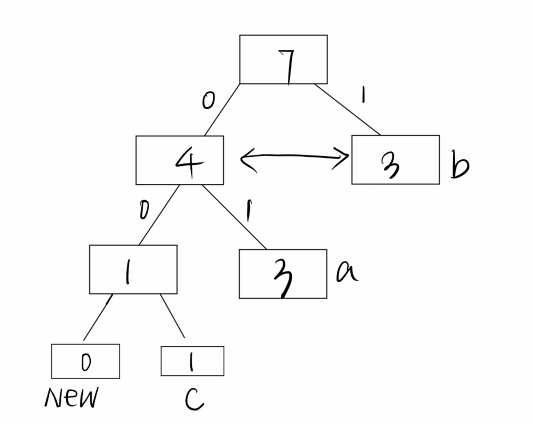
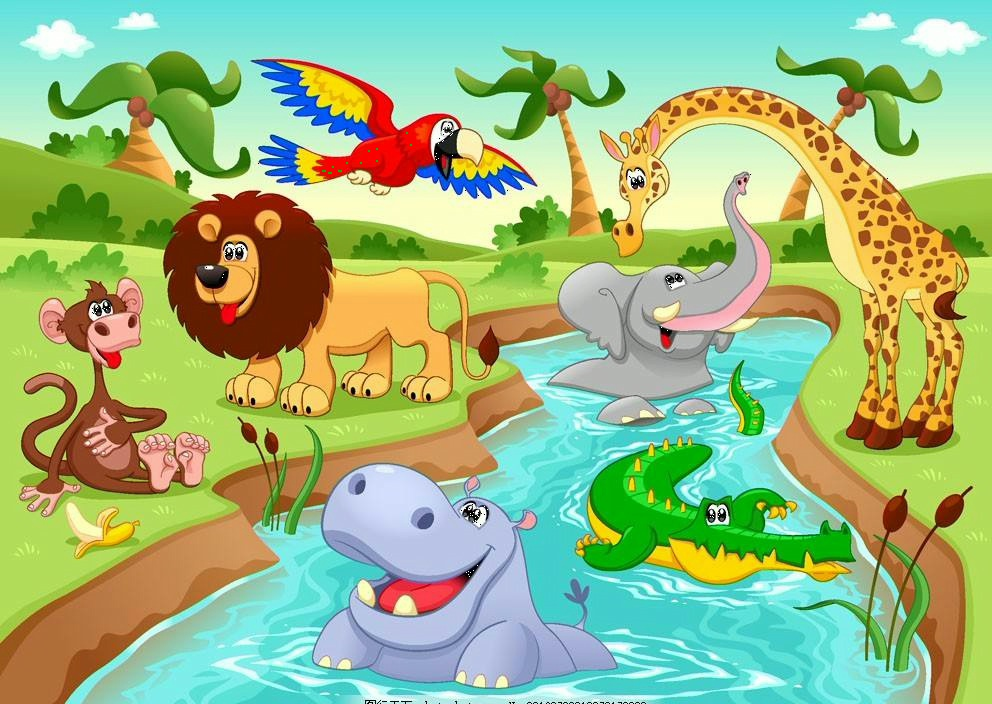
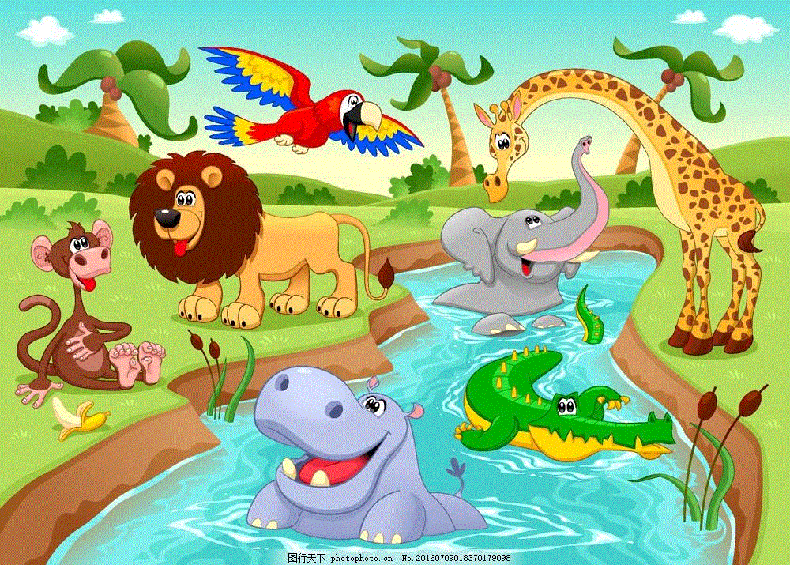
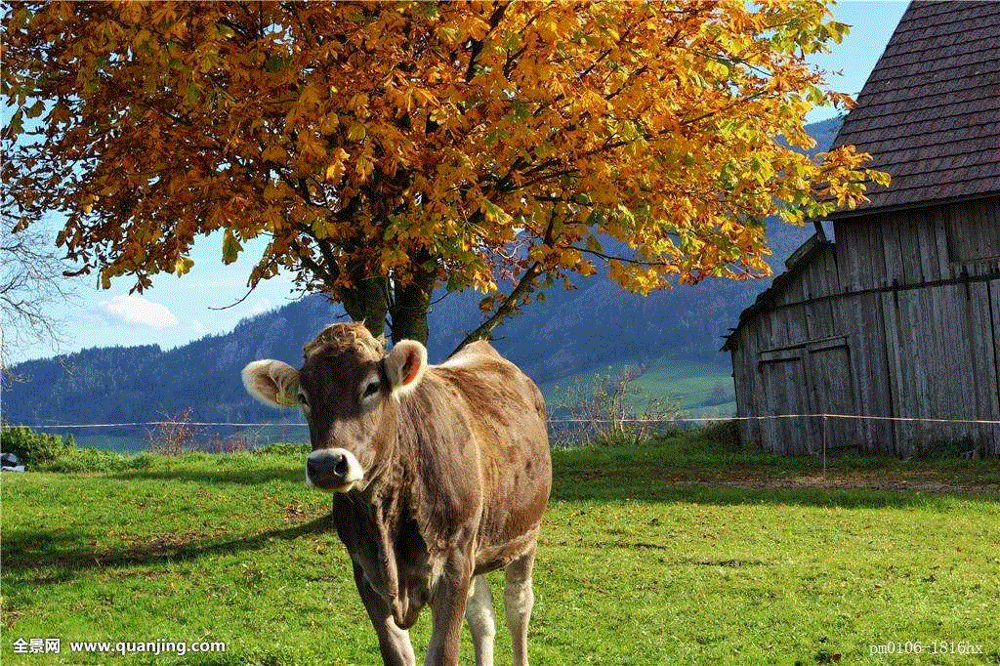

# 多媒体第二次作业

<!-- @import "[TOC]" {cmd="toc" depthFrom=1 depthTo=6 orderedList=false} -->

<!-- code_chunk_output -->

* [多媒体第二次作业](#多媒体第二次作业)
	* [第一题](#第一题)
		* [a](#a)
		* [b](#b)
		* [c](#c)
	* [第二题](#第二题)
		* [理论分析部分](#理论分析部分)
		* [程序实现部分](#程序实现部分)
		* [结果对比部分](#结果对比部分)

<!-- /code_chunk_output -->

## 第一题
### a
**哈夫曼编码**需要有关信息源的先验统计知识，而这样的信息通常很难获得。这在多媒体应用中表现尤为突出。在流式的音频和视频中，数据在到达之前是未知的。即使能够获得这些统计数字，符号表的传输仍然是相当大的一笔开销。
**自适应哈夫曼编码**统计数字是随着数据流的到达而动态地收集和更新的。概率不再是基于先验知识二十基于到目前为止实际收到的数据。随着接收到的符号的概率分布的改变，符号将会被赋予新的码字。
因此自适应哈夫曼编码在先验统计知识无法获得的时候，效果会比哈夫曼编码更好，适用于内容和统计数字快速变化的多媒体数据。而且节省了维护符号表的开销。

### b
接受到的字符为：`b(01)a(01)c(00 10)c(101)`
推导过程：
编码串：`01010010101`
初始编码：`a=00,b=01,c=10,d=11`
因此首先接收到字符 b
| b 计数变成 3  | 和 a 进行交换  |
|---|---|
|   |   |
接收到编码 01，代表 a, 因此 a 计数变为 3


接收编码`00(NEW)`, 代表需要接收一个新字符 
接收 10，查看初始编码表，代表 c,
| 在左边添加新字符 c  | 交换左右子树  |
|---|---|
|   |   |

接收`101`，代表 c:


因此接收到的字符串为 **bacc**

### c
接收到每一个字符后的自适应哈夫曼树：
接收到 b(01):

接收到 a(01)

接收到 c(00 10)
 
接收到 c(c)
 

此时的编码表：
`a：11 b:0 c:101 d:100 11`
推导过程同 i 部分。
## 第二题 

### 理论分析部分
**JPEG**:JPEG 是一种有损压缩的图像存储格式，不支持 **alpha** 通道，由于它具有高压缩比，在压缩过程中把重复的数据和无关紧要的数据会选择性的丢失，所以如果不需要用到`alpha`通道，那么大都图片格式都用该格式。
**GIF**: 图像最广泛的应用是用于显示动画图像，它具备文件小且支持 **alpha** 通道的优点，不过它是由 8 位进行表示每个像素的色彩，仅支持 **256** 色，所以在对色彩要求比较高的场合不太适合。

1. 动物照片使用 `jpeg` 压缩较好，`jpeg` 对于 `gif`，保存的图片数更多，应用了 `DCT` 减少高频内容，同时更有效地将结果保存为位串。压缩使用了人类对灰度视觉敏感度的原理，对亮度进行细量化，色度进行粗量化。显示效果较好。
2. 卡通动画压缩使用 GIF 更好，因为卡通动画图片颜色比较单一，色彩较少，`jpeg` 保留了 24 位的颜色信息，没有必要并且占用了内存。`GIF` 采用的是 `LZW` 压缩算法，因为颜色数较少，`LZW` 的压缩率较高，速度快。而如果 使用 `jpeg` 压缩，压缩率不理想同时也增强颜色显示效果不明显。

### 程序实现部分

jpeg 压缩算法：
`JPEG`压缩编码算法一共分为 11 个步骤：颜色模式转换、采样、分块、离散余弦变换`(DCT)`、`Zigzag` 扫描排序、量化、DC 系数的差分脉冲调制编码、DC 系数的中间格式计算、AC 系数的游程长度编码、AC 系数的中间格式计算、熵编码。
本次代码实现：颜色模式**转换、采样、分块、DCT、量化**这几个模块。相应的有反量化、IDCT、拼接、逆采样。
使用 `python` 实现，主要的的库有 `PIL、numpy、math` 

下面分模块进行说明
**1. 颜色空间转化**
JPEG 采用的是 `YCrCb` 颜色空间，所以需要将 `RGB` 空间转化为 `YCrCb`，`YCrCb`颜色空间中，
Y 代表亮度，Cr,Cb 则代表色度和饱和度（也有人将 Cb,Cr 两者统称为色度）
```python
def rgb2ycbcr(im):
    xform = np.array([[.299, .587, .114], [-.1687, -.3313, .5], [.5, -.4187, -.0813]])
    ycbcr = im.dot(xform.T)
    ycbcr[:,:,[1,2]] += 128
    return np.uint8(ycbcr)
```

**2. 采样**
人类的眼睛对于亮度差异的敏感度高于色彩变化，因此，我们可以认为 `Y` 分量要比 `Cb,Cr` 分量重要的多。代码对于每个 2*2 的块进行采样，比例是`Y:Cb:Cr=4:1:1`, 经过采样处理后，每个单元中的值分别有 4 个 Y、1 个 Cb、1 个 Cr。
```python
def sampling(img):
    samp_y, samp_cb, samp_cr = [], [], []
    for i in range(img.shape[0]):
      for j in range(img.shape[1]):
        samp_y.append(img[i, j, 0])
        if i % 2 == 0 and j % 2 == 0:
            samp_cb.append(img[i, j, 1])
        elif j % 2 == 0:
            samp_cr.append(img[i, j, 2])
    samp_y = np.array(samp_y).reshape([img.shape[0], img.shape[1]])
    samp_cb = np.array(samp_cb).reshape([img.shape[0] // 2,img.shape[1] // 2])
    samp_cr = np.array(samp_cr).reshape([img.shape[0] // 2, img.shape[1] // 2])
    return samp_y, samp_cb, samp_cr
```
在采样之前，需要对图像进行调整，使其可以刚好分成 2\*2 的块，否则 `reshape` 时会出现错误，有因为后面切分成 `8*8` 的块也需要类似的操作，因此我把它放在一起完成：
```python
def fit_block_size(image,block_size=8):
    new_height = (image.shape[0] // 16) * 16 # Taking off the extra bytes
    new_width = (image.shape[1] // 16) * 16
    return image[0:new_height, 0:new_width]
```
接下来的操作都是对 `Y，Cr,Cb` 三个通道独立进行，操作类似，处理量化部分的量化表不一样
**3. 分块**
将图像分为 8*8
```python
def combine_blocks(blocks,shape,block_size=8):
    img = np.zeros(shape,np.uint8);
    indices = [(i,j) for i in range(0, shape[0], block_size) for j in range(0, shape[1], block_size)]
    for block, index in zip(blocks, indices):
      i, j = index
      img[i:i+block_size, j:j+block_size] = block
    return img
```
接下来是对每个 `8*8 `的块单独处理
**4. `DCT`**
然后针对 N\*N 的像素块逐一进行 DCT 操作。JPEG 的编码过程需要进行正向离散余弦变换，而解码过程则需要反向离散余弦变换。
8\*8 的二维像素块经过 DCT 操作之后，就得到了 8*8 的变换系数矩阵。
我们首先生成 dct 矩阵，然后进行 dct 变换，注意这里生成矩阵是要转化为浮点数，否则大部分数据为 0，会直接使图像丢失非常多的信息。
```python
def get_dct_matrix(block_size=8):
    dct_matrix = np.zeros((block_size, block_size))
    for i in range(0, block_size):
        for j in range(0, block_size):
            if i == 0:
                dct_matrix[i][j] = 1/math.sqrt(block_size)
            else:
                dct_matrix[i][j] = math.sqrt(2*1.0/block_size) 
                * math.cos((math.pi*(2 * j + 1) * i)/(2*block_size))
    return dct_matrix
```
```python
def dct(block_matrix, dct_matrix):
    res_dct_matrix = np.dot(np.dot(dct_matrix,block_matrix), np.transpose(dct_matrix))
    return res_dct_matrix
```

**5. 量化**
图像数据转换为 DCT 频率系数之后，进入量化，量化阶段需要两个 8*8 量化矩阵数据，一个是专门处理亮度的频率系数，另一个则是针对色度的频率系数，将频率系数除以量化矩阵的值之后取整，即完成了量化过程。当频率系数经过量化之后，将频率系数由浮点数转变为整数，这才便于执行最后的编码。不难发现，这一部分会丢失数据内容。对于 Y 通道使用亮度量化表，为前者细量化，对于 cb,cr 采用色度量化表，为粗量化。
```python
#亮度量化矩阵
brightness_quantization_matrix = np.array([
 [16, 11, 10, 16, 24, 40, 51, 61],
 [12, 12, 14, 19, 26, 58, 60, 55],
 [14, 13, 16, 24, 40, 57, 69, 56],
 [14, 17, 22, 29, 51, 87, 80, 62],
 [18, 22, 37, 56, 68, 109, 103, 77],
 [24, 35, 55, 64, 81, 104, 113, 92],
 [49, 64, 78, 87, 103, 121, 120, 101],
 [72, 92, 95, 98, 112, 100, 103, 99]
])
#色度量化矩阵
chroma_quantization_matrix = np.array([
       [17, 18, 24, 47, 99, 99, 99, 99],
       [18, 21, 26, 66, 99, 99, 99, 99],
       [24, 26, 56, 99, 99, 99, 99, 99],
       [47, 66, 99, 99, 99, 99, 99, 99],
       [99, 99, 99, 99, 99, 99, 99, 99],
       [99, 99, 99, 99, 99, 99, 99, 99],
       [99, 99, 99, 99, 99, 99, 99, 99],
       [99, 99, 99, 99, 99, 99, 99, 99]])
```
```python
def quantization(dct_coefficient,quantization_matrix,quality_factor=0.1):
    qm = quantization_matrix*quality_factor # 乘以质量因子改变压缩率
    return np.round(dct_coefficient/qm)  # rint = round to int 
```

解码部分，实现以上模块的逆，思路相似：
**反量化**
```python
def de_quantization(dct_result,quantization_matrix,quality_factor=0.1):
    dct_coefficient = quantization_matrix*dct_result*quality_factor
    return dct_coefficient
```
**IDCT**, 与 DCT 类似
```python
def idct(block_matrix, dct_matrix):
    idct_matrix = np.dot(np.dot(dct_matrix.transpose(),block_matrix), dct_matrix)
    return idct_matrix
```
**拼接块**
```python
def combine_blocks(blocks,shape,block_size=8):
    img = np.zeros(shape,np.uint8);
    indices = [(i,j) for i in range(0, shape[0], block_size) for j in range(0, shape[1], block_size)]
    for block, index in zip(blocks, indices):
      i, j = index
      img[i:i+block_size, j:j+block_size] = block
    return img
```
到这一步后我们得到` y,cb,cr` 各个通道，再进行对于 `Cb,Cr` 通道进行**逆采样**，使原来的一个像素点恢复成 2*2 的块
```python
def inverse_sampling(samp_cb, samp_cb,height,width):
    src_cb, src_cr = np.zeros([height, width]), np.zeros([height, width])
    for i in range(samp_cb.shape[0]):
        for j in range(samp_cb.shape[1]):
            val_cb, val_cr = samp_cb[i][j], samp_cb[i][j]
            src_cb[i*2:i*2+2, j*2:j*2+2] = np.array([val_cb, val_cb, val_cb, val_cb]).reshape([2, 2])
            src_cr[i*2:i*2+2, j*2:j*2+2] = np.array([val_cr, val_cr, val_cr, val_cr]).reshape([2, 2])
    return src_cb, origin_cr
```
最后**转化为 rgb**,得到压缩后的图片
```python
def ycbcr2rgb(img, src_cb, src_cr, src_y):
    for i in range(img.shape[0]):
        for j in range(img.shape[1]):
            y = src_y[i, j]
            cb = src_cb[i, j]
            cr = src_cr[i, j]
            img[i, j, 2] = min(255, max(0, round(1.402 * (cr - 128) + y)))
            img[i, j, 1] = min(255, max(0, round(-0.344136 * (cb - 128) - 0.714136 * (cr - 128) + y)))
            img[i, j, 0] = min(255, max(0, round(1.772 * (cb - 128) + y)))
    return img
```

因此流程为 **颜色转换->采样->分块->DCT->量化->反量化->IDCT->合并块->逆采样->颜色转换**，得到压缩后的 `jpeg` 图片
将这个步骤进行整合
`encoder` 函数，接收源图像路径，保存图像路径作为参数
```python
def encoder(path,sava_path):
    im = Image.open(path)
    im = np.asarray(im)
    #首先转化为 ycbcr
    ycbcr=rgb2ycbcr(im)
    #首先进行 padding
    ycbcr  = fit_block_size(ycbcr)
    (height,width) = ycbcr.shape[0], ycbcr.shape[1]
    #二次采样
    img_y, img_cb,img_cr = sampling(ycbcr)
    #分别对每个进行操作
    res_y = process(img_y,brightness_quantization_matrix)
    res_cb = process(img_cb,chroma_quantization_matrix)
    res_cr = process(img_cr,chroma_quantization_matrix)
    #合并图像
    (res_cb,res_cr)= inverse_sampling(res_cb,res_cr,height,width)
    img = np.zeros([height,width,3], dtype=np.uint8)
    ycbcr2rgb(img,res_cb,res_cr,res_y)
    cv2.imshow("result", img)
    cv2.waitKey(0)
    cv2.destroyAllWindows()
    cv2.imwrite(sava_path,img)
    return img
```
`process` 函数为对 `y,cb,cr` 分别进行操作，参数为 1.通道(y,cb,cr)，2. 量化矩阵(对于 y,使用亮度量化矩阵，对于 cb,cr 使用色度量化矩阵)
```python
def process(img,quantization_matrix):
    img = fit_block_size(img)
    blocks = get_blocks(img, 8)
    res_blocks =[]
    dct_matrix = get_dct_matrix(8)
    #对每个块进行处理
    for i in range(len(blocks)):
        for j in range(len(blocks[i])):
            dct_coeff = dct(blocks[i][j], dct_matrix) # dct 
            qua_res_matrix = quantization(dct_coeff, quantization_matrix) # 量化
            #反量化
            dct_coefficient = de_quantization(qua_res_matrix,quantization_matrix)
            # IDCT
            idct_res_matrix = idct(dct_coefficient,dct_matrix)
            res_blocks.append(idct_res_matrix); #将操作结果存在块中
    #拼接块
    res = combine_blocks(res_blocks,img.shape)
    return res
```
完整代码在 `jpeg.py` 中
### 结果对比部分

**视觉效果对比**：
| 原图  | jpeg   | GIF  |
|---|---|---- |
|   |   |   |

| 原图  | jpeg   | GIF  |
|---|---|---- |
|   |   |   |

通过查看视觉效果，发现 GIF 压缩后颜色效果并不好，失真度明显更高，jpeg 颜色显示相对清晰，但是因为压缩过程中高频信息的丢失，会出现一些异常点，这个可以调整量化过程的质量因子获得改善。

效果图可以在 `reslut` 文件夹中查看

**压缩率**：
压缩率=$\frac{B_0}{B_1}$
其中$B_0$为压缩前数据的总位数，$B_1$为压缩后数据的总位数
 1. 动物照片，压缩后 jpeg 图像大小为 `412KB`，量化部分的质量因子为 0.1， `GIF` 压缩后大小 411KB，为原 bmp 大小为 `2,097KB `
       jpeg 压缩率：19.5%
       GIF 压缩率：19.5%
2. 卡通照片，压缩后 jpeg 图像大小为 228KB，量化部分的质量因子为 0.1，GIF 图像 349 KB, 原图 2,146KB 
       `jpeg` 压缩率：`10.5%`
       `GIF` 压缩率：`16.2%`
`jpeg` 的压缩率受量化部分的质量因子影响比较大，如果直接使用课本的量化表，不乘以量化因子，那么图像高频部分出现异常点，影响图像显示的效果。当然此时的压缩率也会比 `GIF` 高。

**失真率**
采用均方差进行量度
公式：
$\sigma^2=\frac{1}{N}\sum_{n=1}^N(x_n-y_n)^2$
其中 $x_n,y_n, 和 N$ 分别为输入数据序列，重现数据序列和数据序列长度
附计算代码：
```python
def compare(img1,img2):
    # print(img1.shape,img2.shape)
    height  = min(img1.shape[0],img2.shape[0])
    width  = min(img1.shape[1],img2.shape[1])
    diff = 0
    diff_r =  np.uint64(0)
    diff_g =  np.uint64(0)
    diff_b =  np.uint64(0)
    for i in range(height):
        for j in range(width):
            diff_r += (img1[i,j,0]-img2[i,j,0])**2;
            print(img1[i,j,0]-img2[i,j,0])
            diff_g += (img1[i,j,1]-img2[i,j,1])**2;
            diff_b += (img1[i,j,2]-img2[i,j,2])**2;
    diff+= diff_r
    diff+= diff_g
    diff+= diff_b
    return diff / (height * width*3)
```
对于两张图片，GIF 的失真度均比 jpeg 算法失真度高
